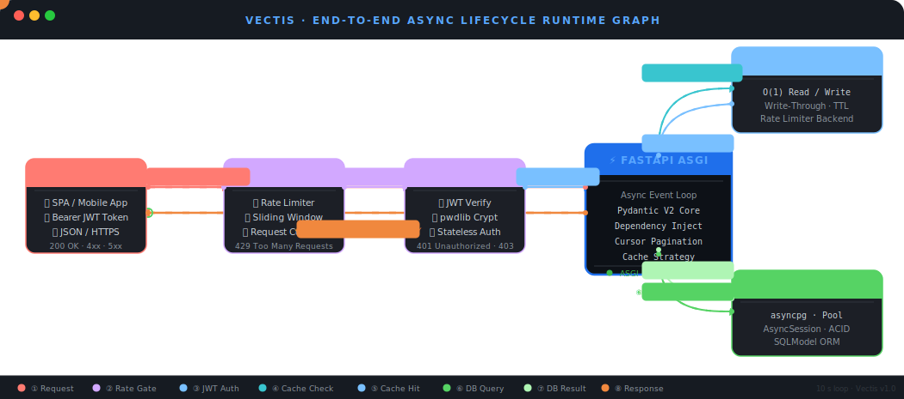

# Vectis 🚀

### High-Throughput Async Content Engine & Secure Authentication Runtime

Vectis is a production-grade, fully asynchronous REST API built with **FastAPI**, **SQLModel**, and **Redis**. Designed to move beyond standard tutorial-tier implementations, Vectis showcases a battle-hardened architecture featuring dual-token authentication, robust cursor-based pagination, and strict database connection multiplexing.

---

## 🛰️ Animated Data Flow Architecture

The following dynamic diagram illustrates how a client request interacts with the Vectis ecosystem. The animated indicators represent real-time data streaming, cache validation, and asynchronous database execution paths.



---

## ⚡ Core Architecture Breakdowns

### 📐 The Architectural Blueprint (Fundamental)

* **100% Type-Safe Contracts:** Built with comprehensive request-response segregation utilizing Pydantic schemas, guaranteeing strict validation barriers for internal business systems.
* **Cryptographic Vaulting:** Employs industry-standard cryptographic primitives via `pwdlib` to handle salt hashing alongside decoupled, stateless JSON Web Tokens (JWT).
* **Relational Integrity:** Implements native normalization patterns using SQLModel, defining programmatic database-level foreign key constraints and cascading mutations cleanly.

### 🚀 High-Concurrency Upgrades (Scalable)

* **Asynchronous I/O Multiplexing:** Completely eliminates execution-thread blocking by upgrading the database engine pipeline to run on non-blocking `asyncpg` drivers and transactional SQLAlchemy `AsyncSession` dependencies.
* **Constant-Time Pagination:** Mitigates severe horizontal scalability bottlenecks by replacing legacy, sequential offset logic with stable $O(1)$ cursor-based retrieval mechanics.
* **Redis Acceleration Layers:** Features decoupled in-memory write-through cache abstraction semantics to reduce storage engine index search pressures on heavy fetch patterns.
* **Production DevOps Controls:** Packaged neatly within containerized Docker Compose clusters and bound to structured automated GitHub Actions pipelines monitoring regression risks using `pytest`.

---

## 🛠️ Technology Stack Matrix

* **Runtime Web Framework:** FastAPI (ASGI Engine)
* **Data Models & ORM:** SQLModel & SQLAlchemy Async
* **Primary Storage Cluster:** PostgreSQL (Driven by `asyncpg`)
* **Caching & Rate Limiting Engine:** Redis 7 Cloud Stack
* **Validation Core:** Pydantic v2
* **Testing & CI Environment:** Pytest Suite + GitHub Actions Engine
* **Infrastructure Management:** Multi-Container Docker Compose Setup

---

## 📂 Code Layout

```text
app/
├── config.py          # Environment & secret settings definitions
├── database.py        # Asynchronous DB engine initialization & Session dependencies
├── main.py            # ASGI application lifecycle hooks & router mapping
├── models.py          # Relational SQLModel schemas mapped to persistent tables
├── oauth2.py          # JWT issuance, verification, and authentication interceptors
├── post_schema.py     # Pydantic data validation structures for operations
├── token_schema.py    # Schema definitions for token validation contracts
├── user_schema.py     # User registration and access token validation patterns
└── routers/
    ├── auth.py        # Identity validation & access token issuance handles
    ├── post.py        # Content mutation, caching, and async pagination handles
    └── user.py        # Identity provisioning and profile synchronization handles
```

---

## 📦 Rapid Deployment Strategy

Execute the following commands to spin up the entire isolated production-mirrored architecture stack (including application workers, PostgreSQL clusters, and active Redis pools) instantly:

```bash
# Clone the repository
git clone https://github.com/Yashdeep1546/Helix.git
cd Helix

# Fire up the entire containerized application infrastructure
docker-compose up --build -d

# Execute the integrated automated test suite across the active cluster
docker-compose exec web pytest
```
